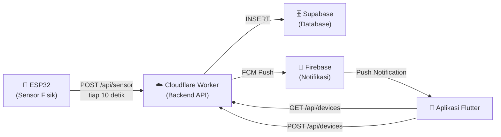
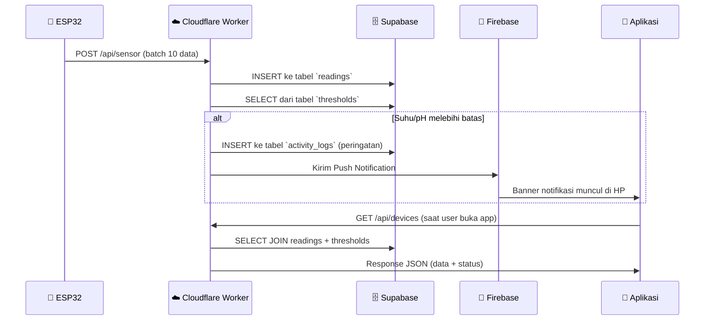

# 📖 Panduan Sistem Sensor AquaPonic

## Arsitektur Keseluruhan



---

## 🔧 Cara Menambahkan Sensor Baru (Step-by-step)

### Langkah 1: Siapkan Hardware ESP32

Setiap unit ESP32 memiliki **Device ID unik** dengan format `esp-XX` (contoh: `esp-01`, `esp-02`, `esp-05`).

Di file firmware ESP32 (contoh: [esp-01.ino](file:///D:/project/AquaPonic/esp32/firmware/esp-01/esp-01.ino)), ubah baris berikut:

```cpp
const char* DEVICE_ID = "esp-05";  // <-- Ganti dengan ID baru yang unik
```

> [!IMPORTANT]
> Setiap unit ESP32 **WAJIB** memiliki `DEVICE_ID` yang berbeda! Jika dua ESP32 pakai ID yang sama, datanya akan tercampur.

Konfigurasi lain yang perlu disesuaikan per unit:
| Parameter | Keterangan | Contoh |
|-----------|-----------|--------|
| `WIFI_SSID` | Nama WiFi di lokasi kolam | `"WiFi-Kolam-A"` |
| `WIFI_PASSWORD` | Password WiFi | `"password123"` |
| `DEVICE_API_KEY` | Kunci autentikasi (SAMA untuk semua unit) | sudah ter-set |
| `PH_SLOPE` & `PH_OFFSET` | Kalibrasi sensor pH (per unit) | lihat `kalibrasi_log.md` |

### Langkah 2: Flash Firmware ke ESP32

1. Buka Arduino IDE
2. Buka file `.ino` yang sudah dikonfigurasi
3. Pilih board **ESP32-S3** dan port COM yang benar
4. Klik **Upload**

Setelah ter-upload, ESP32 akan otomatis:
- Konek ke WiFi
- Sinkron waktu via NTP
- Mulai membaca sensor suhu (DS18B20) dan pH (ADS1115) setiap 1 detik
- Mengirim batch 10 data setiap 10 detik ke server Cloudflare

### Langkah 3: Daftarkan Sensor di Aplikasi

1. Buka aplikasi AquaPonic di HP
2. Di halaman utama (Sensor), ketuk tombol **➕ (Tambah)** di pojok kanan atas
3. Isi form:
   - **Nama Kolam** (opsional): Contoh "Kolam Lele Utara"
   - **Kode Kontroller**: Ketik ID yang sama persis dengan yang ada di firmware ESP32 (contoh: `esp-05`)
4. Ketuk **Konfirmasi**

> [!TIP]
> Format Kode Kontroller **harus** `esp-XX` (huruf kecil, diikuti angka). Contoh valid: `esp-01`, `esp-12`, `esp-99`.

### Langkah 4: Selesai!

Setelah sensor terdaftar, data akan otomatis muncul di dashboard aplikasi dalam hitungan detik (begitu ESP32 mengirim batch data berikutnya).

---

## 📋 Operasi CRUD Sensor

### 1. CREATE (Tambah Sensor)

| Komponen | Detail |
|----------|--------|
| **Layar** | `Tambah Kolam Baru` (tombol ➕ di Sensor) |
| **API** | `POST /api/devices` |
| **Input** | `device` (wajib, format `esp-XX`), `label` (opsional) |
| **Proses** | Server mengecek apakah device sudah terdaftar → jika belum, buat entri baru di tabel `thresholds` dengan nilai default (Suhu: 25-32°C, pH: 6.5-8.5) |

### 2. READ (Lihat Sensor)

| Komponen | Detail |
|----------|--------|
| **Layar** | Halaman utama `Sensor` (daftar semua kolam) |
| **API** | `GET /api/devices` → semua device + data terbaru |
| **API** | `GET /api/devices/:id/live` → data real-time satu device |
| **API** | `GET /api/devices/:id/series` → data grafik (dengan filter waktu) |

### 3. UPDATE (Edit Sensor)

| Komponen | Detail |
|----------|--------|
| **Layar** | Ketuk kolam → ikon ⚙️ (Settings) di pojok kanan atas |
| **API** | `PUT /api/devices/:id` |
| **Yang bisa diubah** | Nama kolam, Batas suhu min/max, Batas pH min/max |

### 4. DELETE (Hapus Sensor)

| Komponen | Detail |
|----------|--------|
| **Layar** | Ketuk kolam → ⚙️ → scroll ke bawah → "Hapus Sensor" |
| **API** | `DELETE /api/devices/:id` |
| **Catatan** | Data riwayat pembacaan sensor **TIDAK dihapus** dari database (tetap aman) |

---

## 🔄 Alur Data Lengkap



---

## ⚠️ Catatan Penting untuk Client

1. **ESP32 harus terhubung WiFi** — Jika WiFi mati, data tidak terkirim (tapi ESP32 akan otomatis reconnect)
2. **Satu ESP32 = Satu Kolam** — Jangan pakai Device ID yang sama untuk kolam berbeda
3. **Notifikasi otomatis** — Jika suhu atau pH melewati batas yang diatur, notifikasi HP akan bunyi otomatis (bahkan saat aplikasi dimatikan)
4. **Export CSV** — Data bisa diexport ke file CSV dari halaman detail sensor (ikon 📥 di pojok kanan atas)
